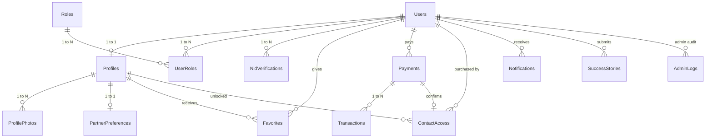

# Matrimony Hub - Database Schema Documentation

## Database Engine
- **RDBMS**: MySQL 8.0+ / MariaDB 10.5+
- **Charset**: `utf8mb4`
- **Collation**: `utf8mb4_unicode_ci`
- **Storage Engine**: `InnoDB` (ACID compliant with Foreign Key cascading & row-level locking)

## Relational Schema Diagram

## Table Specifications & Key Constraints

### 1. `Users`
- Stores authentication credentials, full name, phone number, and account lifecycle state.
- **Constraints**: `UQ_Users_Email` (UNIQUE), `IX_Users_PhoneNumber` (INDEX).

### 2. `Profiles`
- 1-to-1 extension of `Users` containing matrimonial demographics.
- **Constraints**: `UQ_Profiles_UserId` (UNIQUE FK to `Users.Id`), `CHK_Profiles_Gender`, `CHK_Profiles_Height`.

### 3. `Favorites`
- Stores saved bookmarks.
- **Constraints**: `UQ_Favorites_User_Profile` (`UserId`, `FavoriteProfileId`) prevents duplicate entries.

### 4. `ContactAccess`
- Authoritative access ledger granting contact view permission.
- **Constraints**: `UQ_ContactAccess_User_Target` (`UserId`, `TargetProfileId`) prevents duplicate access grants.
- Foreign Key to `Payments.Id` ensures access is linked to verifiable payment.

### 5. `Payments` & `Transactions`
- Stores payment intentions and completed gateway callbacks.
- **Constraints**: `UQ_Payments_TransactionId` (UNIQUE), `CHK_Payments_Amount` (`Amount > 0`).

### 6. `NidVerifications`
- Stores sensitive national ID number and secure document scan locations.
- **Constraints**: FK to `Users.Id` (Submitter), FK to `Users.Id` (`ReviewedByAdminId`).
